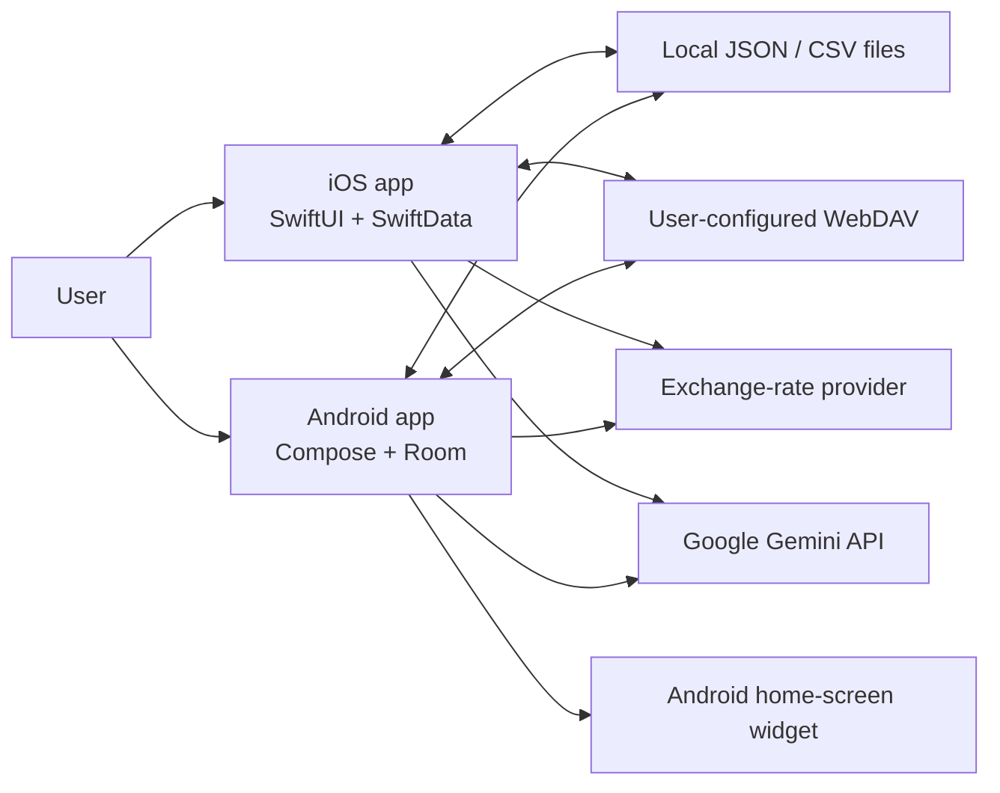
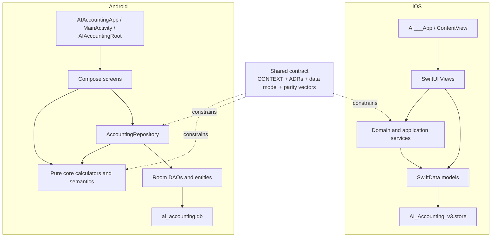
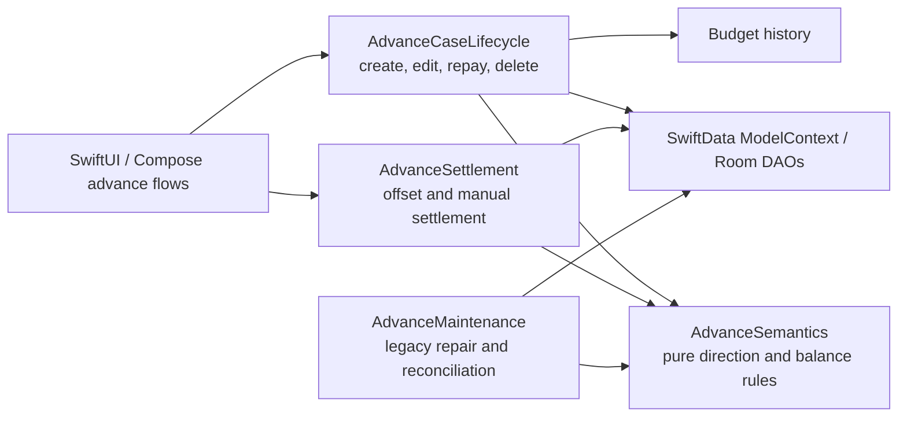
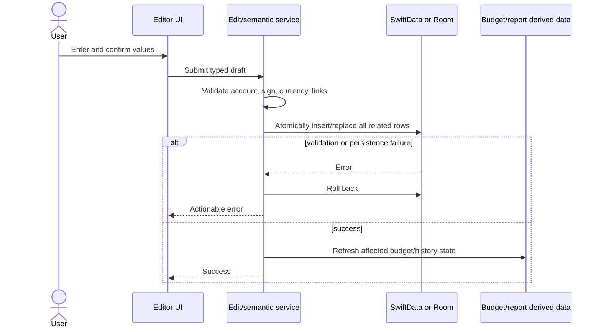
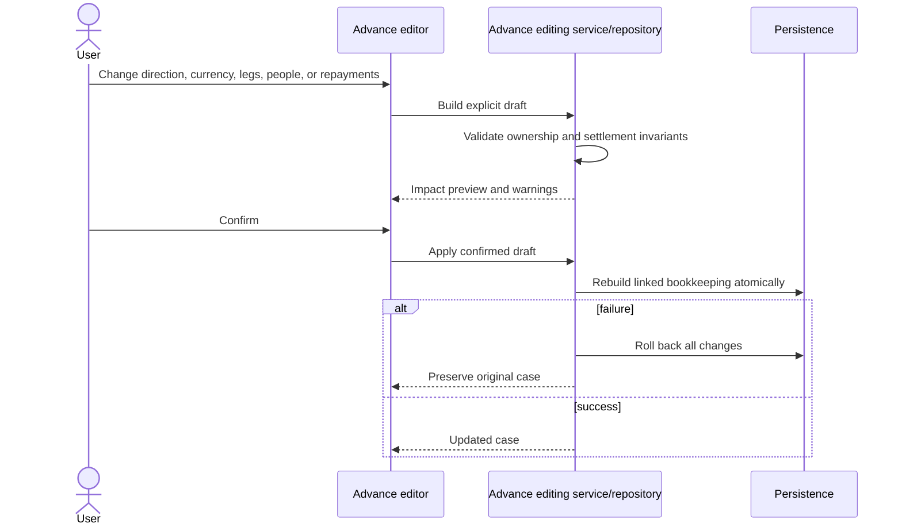
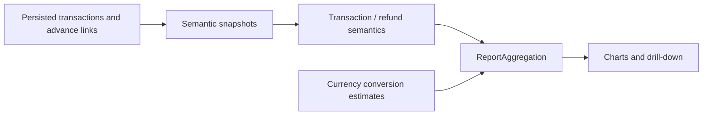
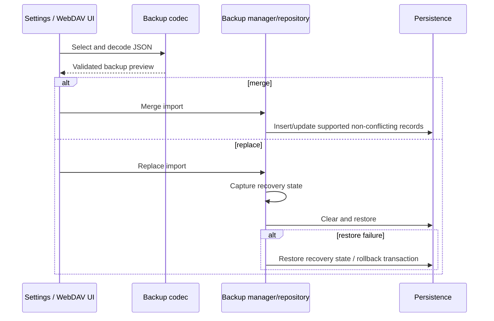
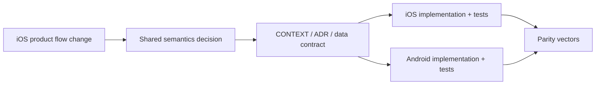

# Architecture

Status: Active
Last reviewed: 2026-07-10
Applies to: iOS, Android
Source of truth: current application entry points, persistence models, services/repository, [`CONTEXT.md`](../CONTEXT.md), and accepted [`adr/`](./adr/)

AI Accounting is an offline-first personal ledger with separate native iOS and Android implementations. iOS defines product flow and user-facing semantics; both platforms share the accounting contract, backup format, and deterministic parity vectors.

## System Context

The app has no project-owned backend and no live cross-device synchronisation. WebDAV is deliberate backup and restore, not database replication.

## Platform Layers

### iOS responsibilities

- `AI___App.swift` owns store startup, pre-migration safety, and `ModelContainer`.
- `ContentView.swift` owns the top-level tabs and global add flows.
- `Views/` owns presentation state, navigation, input, and rendering.
- `Services/` owns accounting semantics, multi-record edits, reports, backup, repair, and external integrations.
- `DataModels.swift` owns persisted SwiftData entities and raw-value adapters.
- Complex writes use service APIs and `ModelContext.rollback()` on failure. Views must not recreate multi-record accounting logic.

### Android responsibilities

- `AIAccountingApp` creates `AppContainer`; `MainActivity` provides repository, currency, and UI preferences to Compose.
- `AIAccountingRoot` owns navigation and top-level app chrome.
- `ui/screens/` owns presentation state and user interaction.
- `core/` contains platform-independent calculations, enum contracts, report semantics, and security helpers.
- `AccountingRepository` is the application/persistence boundary for multi-record operations.
- `data/db/` owns Room entities, DAOs, relations, converters, and explicit migrations.
- Related writes use `RoomDatabase.withTransaction`. Screens must not write directly to DAOs.

## Advance Domain Modules

- `AdvanceSemantics` is pure and cannot read or write persistence.
- `AdvanceCaseLifecycle` owns ordinary case mutations and keeps linked bookkeeping and budget history atomic.
- `AdvanceSettlement` owns grouped ledger-only settlement operations and grouped rollback.
- `AdvanceMaintenance` owns explicit repair/backfill operations; it is not part of normal user-entry flow.
- Modules use concrete implementations until a second real adapter justifies an interface.
- UI-facing drafts use IDs and scalar values rather than transporting SwiftData or Room entities across the module boundary.

Current extraction status:

- `AdvanceSemantics` and `AdvanceMaintenance` are concrete modules on both platforms.
- iOS implementations live in `AI 記帳/Services/Advances/`; Android implementations live in `core/advance/` and `data/advance/`.
- `AdvanceService`, `AdvanceCaseEditingService`, and Android `AccountingRepository` remain compatibility seams for lifecycle and settlement operations until the later ADR 0005 slices migrate their callers.
- The diagram above is the accepted target boundary, not a claim that every extraction slice is already complete.

The staged extraction and compatibility rules are recorded in [`adr/0005-advance-domain-modules.md`](./adr/0005-advance-domain-modules.md).

## Source-Of-Truth Hierarchy

When sources disagree, resolve them in this order:

1. Accepted ADR for accounting meaning.
2. [`CONTEXT.md`](../CONTEXT.md) vocabulary and invariants.
3. [`specs/data-model.md`](./specs/data-model.md) persisted and backup contract.
4. [`specs/parity-test-vectors.md`](./specs/parity-test-vectors.md) deterministic behaviour.
5. Current tested domain service/core implementation.
6. UI copy and README descriptions.

iOS is the source of truth for information architecture and flow. It is not allowed to override shared accounting semantics without updating the contract and Android.

## Ledger Write Flow

- Ordinary income/expense may be a single row.
- Transfers, debt flows, advances, repayments, refunds, and grouped edits can affect several rows and must use a domain operation.
- A UI success state is shown only after persistence succeeds.

## Advance Structural Edit Flow

Special settlement groups such as mutual offsets and manual cross-currency settlements are rolled back as a group before structural editing. They are not edited as ordinary repayments.

## Report Read Flow

Reports use transaction currency, not account currency. Transfers and settlement-only records are excluded. Main-currency values are estimates using the current rate service; original-currency totals remain available for audit.

## Backup And Restore Flow

Detailed migration and recovery rules are in [`DATA_MIGRATION_AND_RECOVERY.md`](./DATA_MIGRATION_AND_RECOVERY.md).

## Cross-Platform Parity

A shared feature is complete only when affected semantics, backup compatibility, tests, and documentation agree on both platforms. The Android widget and platform-native system pickers are the currently accepted platform differences.

## External Boundaries

- **Gemini**: optional user-provided API key; outputs are suggestions that require user review.
- **Exchange rates**: live rates with cached fallback; estimates are not historical FX facts.
- **WebDAV**: user credentials and optional backup passphrase; manual upload/restore only.
- **Files**: JSON is the recovery contract; CSV is a report export, not an import or lossless backup.
- **Secure storage**: iOS Keychain and Android Keystore-backed storage hold secrets. Secrets do not belong in SwiftData, Room, JSON backup, logs, or fixtures.

## Architecture Change Rules

Create or update an ADR when a change:

- changes report inclusion or accounting meaning;
- changes ownership of records or transaction grouping;
- introduces a new persistence/external-system boundary;
- is difficult to reverse;
- changes how iOS and Android divide responsibility.

Update this document when layer boundaries, entry points, data flow, or external integrations change.
